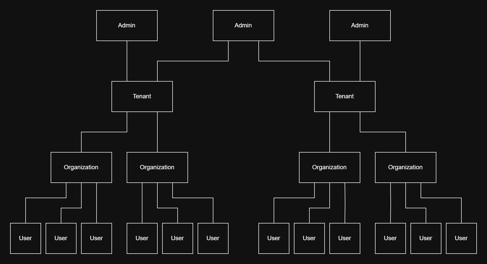

# Overview

Before getting started with CentralAuth, it's important to understand the key concepts and components that make up the platform. This section provides an overview of CentralAuth's architecture.

This diagram illustrates the relationships between the main entities in CentralAuth. Here's a brief description of each component:

- **Admin**: A user with administrative privileges who can manage one or more CentralAuth tenants, configure authentication settings for organizations, and monitor user activity.
- **Tenant**: A top-level container for one or more organizations. Tenants are used to group related organizations and manage their authentication settings. Each tenant can have one or more admins with different roles and permissions on the tenant and its organizations.
- **Organization**: An organization represents a company or application that uses CentralAuth for authentication. Each organization has its own set of users and authentication settings. An organization can consist of multiple websites/domains that share the same authentication settings and user database.
- **User**: An individual who has an account with an organization. Users are grouped in a single organization. Each user is identified by a unique email address. A user can log in to the organization's websites via the authentication methods configured on the organization.