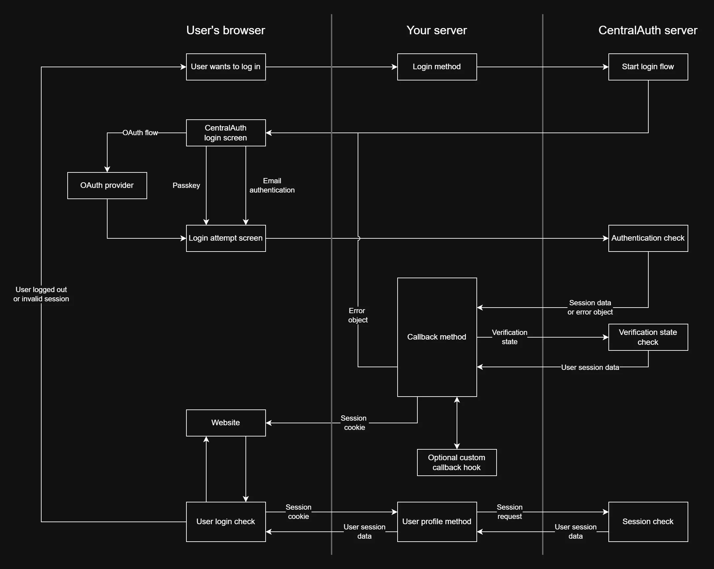

# Overview

This graph shows the CentralAuth login flow. It illustrates the interaction between your application and the CentralAuth service, including the authentication process and user redirection. 

In this section, we will explore the key components of the login flow and how to implement them in your application. 

### Step 1: User initiates login

The user starts the login process in your application. This action triggers a redirect to the CentralAuth authorization endpoint, which will either be `centralauth.com` or a [custom domain](/admin/dashboard/organization/settings#custom-domains).

### Step 2: User authentication

The user is presented with the authentication methods made available on your organization. The user selects their preferred method and logs in.

### Step 3: Authentication check

CentralAuth verifies the user's credentials and sends an OAuth code back to your application.

### Step 4: Token exchange

The callback method in your application receives the OAuth code and exchanges it for an access token. This token is used to authenticate the user in your application. Typically, this token is stored in a cookie or local storage for future use.

### Step 5: User redirection

The user is redirect back to your website, usually based on a given `return_to` parameter. This parameter is typically a URL that the user was trying to access before being redirected to CentralAuth for authentication.

### Step 6: User session check

Your application checks if the user has a valid session through the userinfo method. If the session is valid, the user is granted access to the requested resource. If not, the user is redirected to the login page.

:::info
Step 6 will be repeated for every request to your application. The user will be redirected to the login page if their session is invalid or expired.
:::

When the user logs out, your application should invalidate the session and redirect the user to the CentralAuth logout endpoint. This will ensure that the user is logged out of all applications using CentralAuth for authentication.